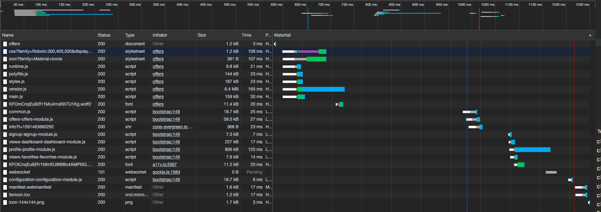

## Lazy loading y preloading

En la siguiente imagen podemos ver como primero carga el módulo inicial y pasado un lapso de tiempo, se cargan los 
otros módulos. En mi aplicación ya tenía todos los módulos con Lazy Loading así que solamente he tenido que actualizar
la configuración para que soporte el preloading.

 