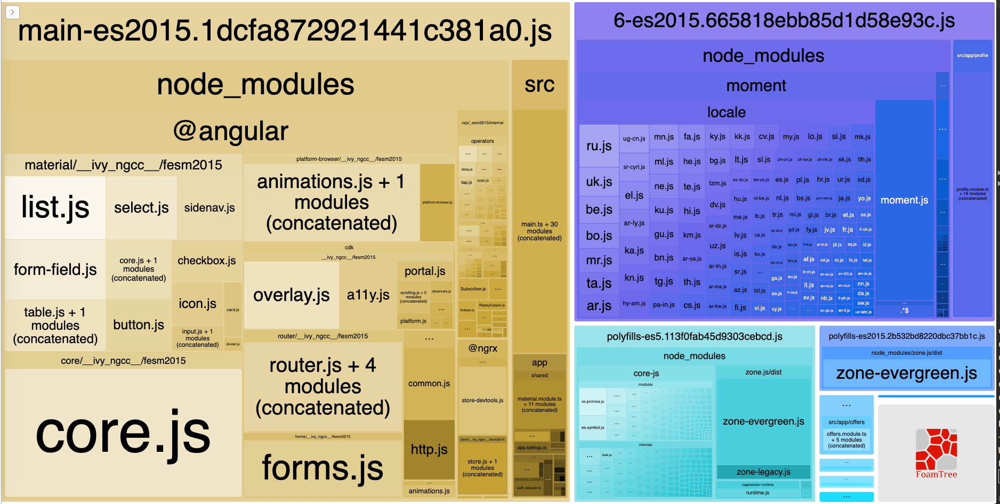

## Webpack bundle analyzer

Con webpack bundle analyzer podemos ver todos los módulos que se van cargando y cuales
son sus dependencias. También podemos ver el peso de cada directorio y vemos que el `src/`
que es donde tenemos los módulos, es bastante inferior a otros.
